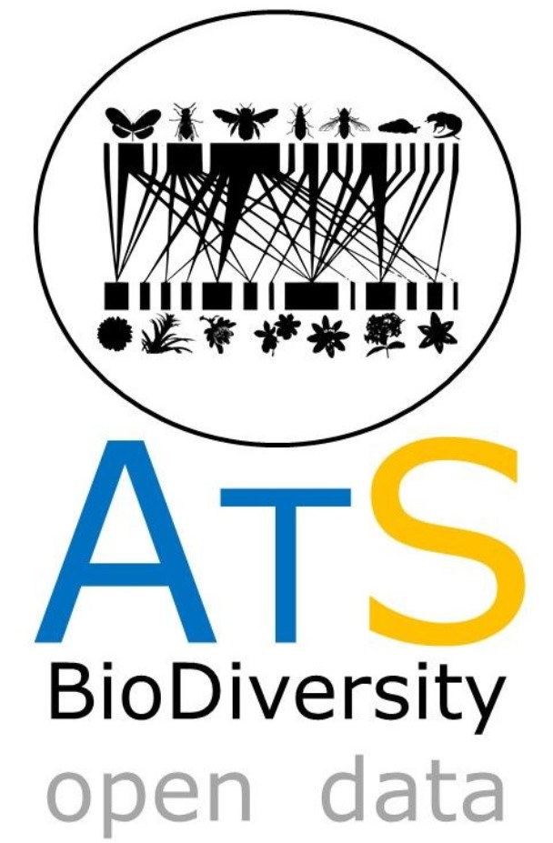
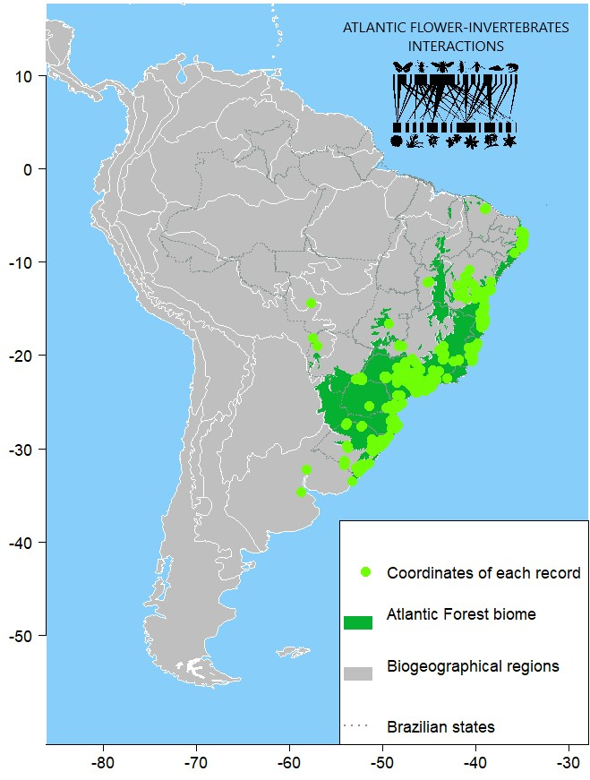

# ATLANTIC-FLOWER-INVERTEBRATES-INTERACTIONS

ATLANTIC-FLOWER-INVERTEBRATES-INTERACTIONS dataset is part of the ATLANTIC series, on which research teams are compiling biodiversity information of 
Atlantic forest biome. This paper follows previous published data papers in Ecology 
([ATLANTIC-FRUGIVORY](http://onlinelibrary.wiley.com/doi/10.1002/ecy.1818/abstract): Bello et al. 2017, 
[ATLANTIC SMALL-MAMMAL](http://onlinelibrary.wiley.com/doi/10.1002/ecy.1893/full): Bovendorp et al. 2017, 
[ATLANTIC-CAMPTRAPS](http://onlinelibrary.wiley.com/doi/10.1002/ecy.1998/abstract): Lima et al. 2017 and 
[ATLANTIC BATS](http://onlinelibrary.wiley.com/doi/10.1002/ecy.2007/abstract): Muylaert et al. 2017).

 This dataset has  ~18 thousand interaction records forming 479 networks, each containing from 1 to 1,061 interaction links.  Each network was sampled for about 200 hours or less, with few exceptions. It was reported 650 plant genera within 138 different families and 40 orders with the most abundant and rich families being Asteraceae, Fabaceae and Rubiaceae. Animals interacting with these plants were all arthropods from 10 orders, 136 families and 601 genera, comprising 2,429 morphotypes (including 988 species). Hymenoptera was the most abundant and diverse order with at least 6 times more records than the second-ranked order (Lepidoptera). The complete dataset network shows Hymenoptera interacting with all plant orders, also depicting  Diptera, Lepidoptera, Coleoptera and Hemiptera as important nodes. Among plants, Asterales and Fabales had the highest amount of interactions. The best-sampled environment was forest (~8,000 records), followed by pastures and crops. Savanna, grasslands and urban environments (among others) were also reported, indicating a wide range of approaches dedicated to collecting flower-invertebrate data in the Atlantic Forest domain. Nevertheless, most reported data was from forest understory or lower strata, indicating a knowledge-gap about flower-invertebrate interactions at the canopy. Also, access to remote regions still is a limitation generating sampling gaps in the geographical range of the Atlantic Forest. Future studies in these remote and continuous forested areas shall bring important new information regarding the interactions between flowers and invertebrates  at the Atlantic Forest.

 

The dataset accompanies our Data Paper to be published in Ecology:  

Boscolo D., B.N. Rodrigues, P.A. Ferreira, L.E. Lopes, V.R. Tonetti, I.C.R. Santos, J.A. Hiruma-Lima, L.Nery, K.B. Lima, J.R. Perozi, A.V.L. Freitas, B.F. Viana, C. Antunes-Carvalho, D.S. Amorim, F.F. Oliveira, M. Groppo, M.L. Absy, R.J. Almeida-Scabbia, A. Alves-Araújo, F.W. Amorim, Y. Antonini, C. Aoki, D.S. Aragão, T.C.T. Balbino, M.S.F. Bandeira, B.C. Barbosa, M.R.V. Barbosa, G.J. Barônio, L.O. Barros, M. Beal-Neves, V.M. Bertollo, A.D.M. Bezerra, C.R. Buzatto, L.T. Carneiro, E. Caron, C.S. Carpim, E.S. Carvalho,T.L. Carvalho, L.J. Carvalho-Leite, M.F. Cascaes, F.S. Castro, A. Cavalleri, E. Cazetta, M.T. Cerezini, L.F.M. Coelho, R. Colares, G.D. Cordeiro, J. Cordeiro, A.M.S. Correa, F.V. Costa, C. Covre, R.D.M. Cruz, O. Cruz-Neto, L. Correia-da-Rocha-Filho, J.H.C. Delabie, M.C. Dórea, V.T. do-Nascimento, J.M.A. dos-Santos, M. Duarte, M.C. Duarte, O.M.P. Duarte, J.H.A. Dutilh, B.P. Emerick, G.S. Fabiano, F.H.A. Farache, A.P.G. Faria, G.W. Fernandes, P.M.A. Ferreira, M.J. Ferreira-Caliman, L.M.N. Ferreira, T.F. Figueira-de-Sá, E.V. Franceschinelli, G.A. Franco-Assis, F. Fregolente-Faracco-Mazziero, B.M. Freitas, J. Freitas, N.A. Galastri, L. Galetto, C.T. Garcia, M.T.A. García, C.A. Garófalo, I. Gélvez-Zúñiga, C.S. Goldas, T.J. Guerra, T.M. Guerra, B. Harter-Marques, J. Hipólito, R. Kamke, R.P. Klein, E.B.A. Koch, P. Landgref-Filho, S. Laroca, C.M. Leandro, R. Lima, T.R.A. Lima, L.W. Lima-Verde, E.J. Lírio, A.V. Lopes, A.P. Luizi-Ponzo, I.C.S. Machado, T. Machado, F.S. Magalhães, T. Mahlmann, C.S.F. Mariano, T.E.D. Marques, F. Martello, C.F. Martins, M.N. Martins, R. Martins, A.L.S. Mascarenhas, G.A. Mendes, M.S. Mendonça, L. Menini-Neto, M.A. Milward-de-Azevedo, A.O. Miranda, P.M. Montoya-Pfeiffer, A.M. Moraes, B.B. Moraes, E.F. Moreira, M.S.C. Morini, D. Moure-Oliveira, L.F. Nadai, V.H. Nagatani, M.H. Nervo, F.S. Neves, J.S. Novais, É.S.A. Oliveira, J.H.F. Oliveira, A.J.S. Pacheco-Filho, L. Palmieri, M. Pareja, M.A. Passarella, N.M. Passos, H.F. Paulino-Neto, A.L. Peixoto, L.C. Pereira, R.A.S. Pereira, B. Pereira-Silva, J. Pincheira-Ulbrich, Ma. Pinheiro, A.J. Piratelli, L.R. Podgaiski, D.S. Polizello, L.P. Prado, F. Prezoto, F.R. Quadros, E.P. Queiroz, Z.G.M. Quirino, A.M. Rabello, G.B.P. Rabeschini, M.M.M. Ramalho, F.N. Ramos, L. Rattis, L.H.G. Rezende, C. Ribeiro, L.J. Robe, E.M.S.R. Rocha, R.R. Rodrigues, G.Q. Romero, N. Roque, W.O. Sabino, P.T. Sano, P.S. Santana, F.S. Santos, I.A. Santos, F.A.R. Santos, I.S. Santos, R. Sartorello, H.J. Schmitz, M.R. Sigrist, J.C. Silva, A.C.G. Silva, C.V.C. da-Silva, B.S.A.V. Silva, B.L.F. Silva, C.I. Silva, F.O. Silva, J.L.S. Silva, N.S. Silva, N.L.G. Silva, O.G.M. Silva, C.M. Silva-Neto, E.R. Silva-Neto, D. Silveira, M.S. Silveira, R.B. Singer, L.A.S.S. Soares,E.L. Souza, J.M.T. Souza, J. Steiner, M.C. Teixeira-Gamarra, B.A. Trentin, I.G. Varassin, G.V. Verde-Nunes, V.N. Yoshikawa, E.M. Zanin, M. Galetti, and M.C. Ribeiro. 2022. ATLANTIC FLOWER-INVERTEBRATES INTERACTIONS: a dataset of occurrence and frequency of flower visitation. Ecology, 00: 000-000.

## Class I. Data set descriptors
### I.A. Data set identity:

Title: ATLANTIC FLOWER-INVERTEBRATE INTERACTIONS​: a dataset of occurrence and frequency of flower visitation interactions in the Atlantic forest.

### I.B. Data set identification code:
(1) AtlanticForestInvertFloInteractionData_2019-11.csv, 19.5 MB ; (2) AtlanticForestInvertFloAuthorsInfo_2019-11.csv, 18.2 KB

### C. Data set description:
This dataset encompasses 17957 records of interactions between flowers and invertebrates and cover wide latitudinal (from -4.2º to -34.7º) and longitudinal (from -34.8º to -58.8º) ranges of the South-American AF domain (Fig. 1). Because of the irregular distribution of the AF, and to provide a broad biogeographical consistency within the Neotropics, the geographical boundaries used in this study were those defined by Ribeiro et al. (2009) and the Chacoan and Parana biogeographic dominions as proposed by Morrone (2014). Each record (individual line in the main dataset table) contains a description of the location of the record, details on how the data was acquired and detailed taxonomic information of both the plant and animal detected in direct interaction, among other information. 

## Principal Investigators

(1)Danilo Boscolo
Universidade de São Paulo (USP), Faculdade de Filosofia, Ciências e Letras de Ribeirão Preto, Departamento de Biologia, Av. dos Bandeirantes 3900, Ribeirão Preto, SP, 14040-901, Brazil. National Institute of Science and Technology in Interdisciplinary and Transdisciplinary. Studies in Ecology and Evolution (IN-TREE), Federal University of Bahia, Salvador, Brazil.

(2)Barbara Nobrega Rodrigues
Universidade de São Paulo (USP), Faculdade de Filosofia, Ciências e Letras de Ribeirão Preto, Departamento de Biologia, PPG Entomologia, Av. dos Bandeirantes 3900, Ribeirão Preto, SP, 14040-901, Brazil.

(3)Patrícia Alves Ferreira
Environmental Sciences Department  – DCAm, Federal University of São Carlos, São Paulo, Brazil. National Institute of Science and Technology in Interdisciplinary and Transdisciplinary. Studies in Ecology and Evolution (IN-TREE), Federal University of Bahia, Salvador, Brazil.

(4)Luciano Elsinor Lopes
Environmental Sciences Department  – DCAm, Federal University of São Carlos, São Paulo, Brazil. National Institute of Science and Technology in Interdisciplinary and Transdisciplinary. Studies in Ecology and Evolution (IN-TREE), Federal University of Bahia, Salvador, Brazil.

(5)Milton Cezar Ribeiro
Universidade Estadual Paulista (UNESP), Instituto de Biociências, Departamento de Ecologia, CP 199, Rio Claro, SP, 13506-900, Brazil.

